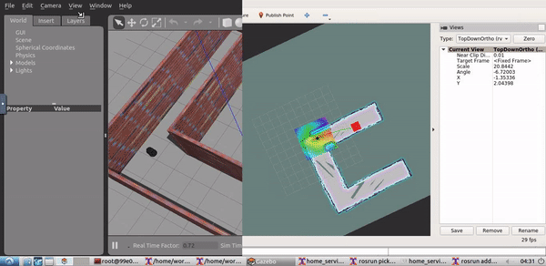

# Udacity Student Project: Simulate A Home Service Robot
A Udacity student project to simulate a full home service robot capable of navigating to pick up and deliver virtual objects.

1) Design a simple environment with the Building Editor in Gazebo.

2) Teleoperate your robot and manually test SLAM.

3) Create a wall_follower node that autonomously drives your robot to map your environment.

4) Use the ROS navigation stack and manually commands your robot using the 2D Nav Goal arrow in rviz to move to 2 different desired       positions and orientations.

5) Write a pick_objects node that commands your robot to move to the desired pickup and drop off zones.

6) Write an add_markers node that subscribes to your robot odometry, keeps track of your robot pose, and publishes markers to rviz.

## Install Official ROS Packages
``` bash
$ git clone https://github.com/ros-perception/slam_gmapping
$ rosdep -i install gmapping
$ git clone https://github.com/turtlebot/turtlebot
$ rosdep -i install turtlebot_teleop
$ git clone https://github.com/turtlebot/turtlebot_interactions
$ rosdep -i install turtlebot_rviz_launchers
$ git clone https://github.com/turtlebot/turtlebot_simulator
$ rosdep -i install turtlebot_gazebo
$ git clone https://github.com/turtlebot/turtlebot_apps
$ rosdep -i install turtlebot_navigation
```

## Create Required ROS Packages/Nodes
``` bash
$ catkin_create_pkg wall_follower roscpp
$ catkin_create_pkg pick_objects move_base_msgs actionlib roscpp
$ catkin_create_pkg add_markers roscpp visualization_msgs nav_msgs
```

## Run the Shell Script
``` bash
$ cd /home/workspace/catkin_ws/src/ShellScripts
$ chmod +x home_service.sh
$ ./home_service.sh
```

## Result

